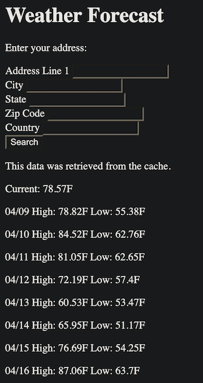
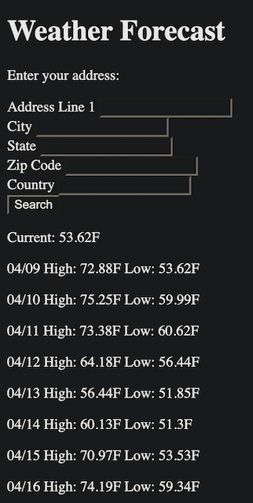

# README

## Summary
This application consists of a single page which displays the current temperature and weather forecast for a given address.


Subsequent requests for addresses in the same zip code will return the cached result from the first request for 30 minutes. The page indicates whether the results came from the cache or not.


## Prerequisites
* Ruby 3.2.2
* Git
* Bundler version 2.4.10

## Setup
```bash
git clone https://github.com/pirelliandrew/apple_demo.git
cd apple_demo
bundle install
bundle exec rails dev:cache # Ensure cache is enabled in development
```

## Running the application
```bash
bundle exec rails s
```

Application is accessible at http://localhost:3000/weather.

## Tests
Unit tests were written at the API layer using RSec. The test suite can be ran using the following command:
```bash
bundle exec rspec
```

For detailed documentation on the behavior of the API, use:
```bash
bundle exec rspec --format documentation
```
